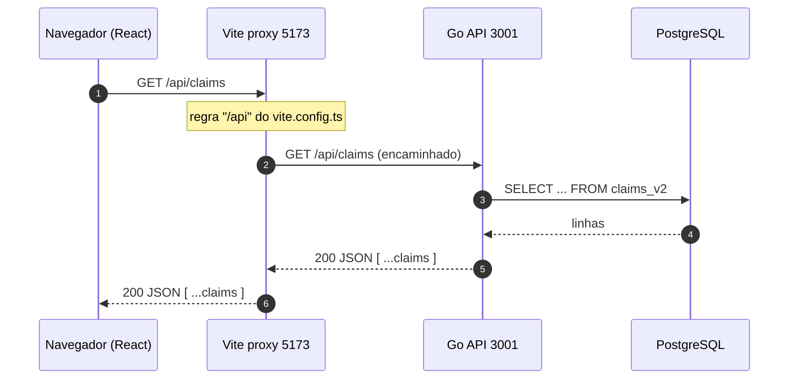
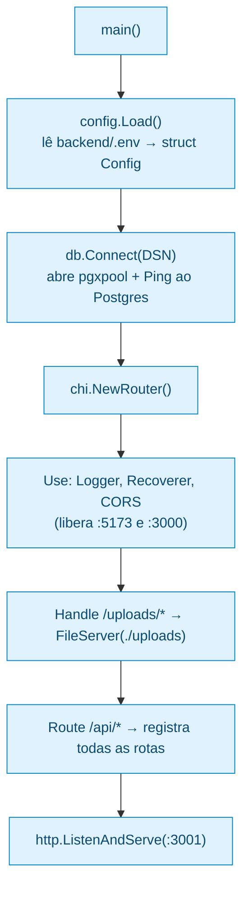
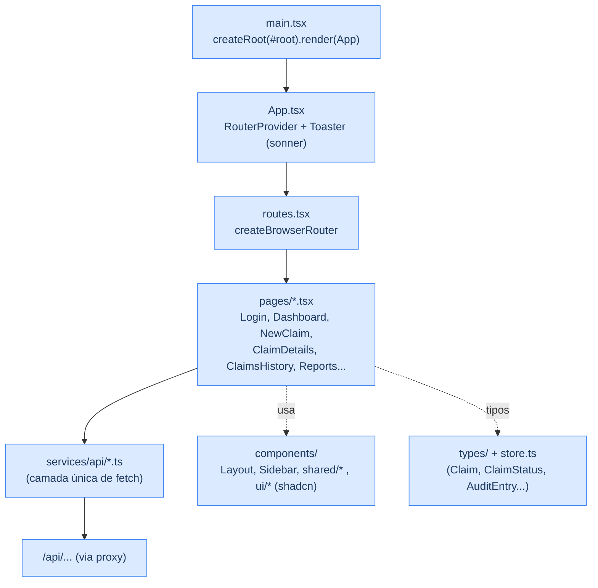
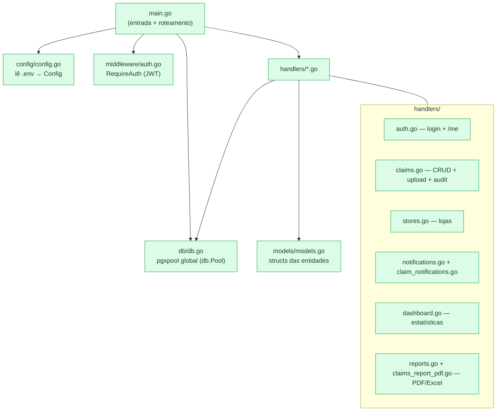
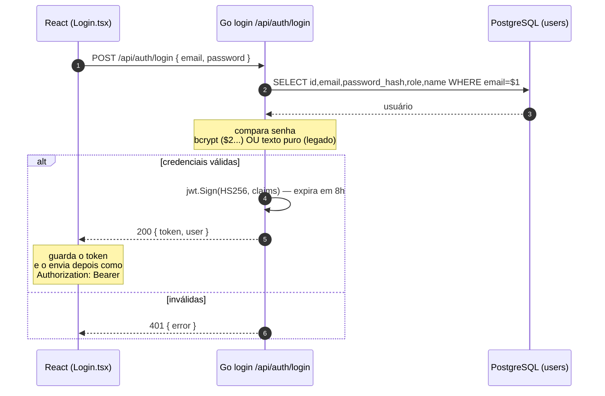
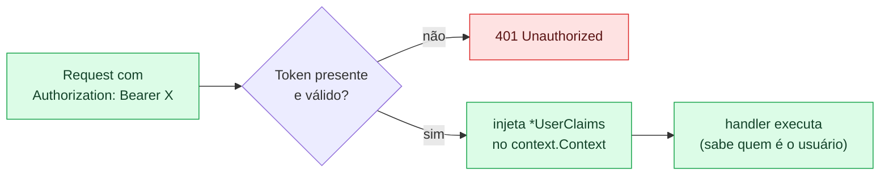
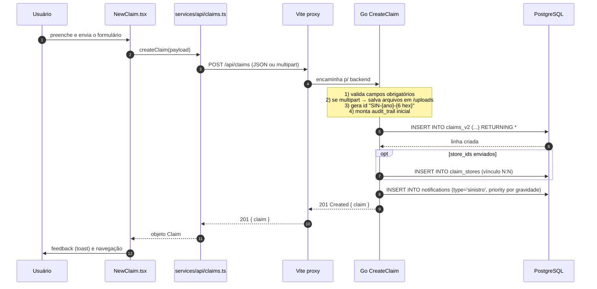

# Arquitetura & Fluxo de Dados — JP Mall

> Sistema de **gestão de sinistros e ocorrências** de um shopping center.
> Frontend **React + Vite + TypeScript** • Backend **Go (chi v5)** • Banco **PostgreSQL (pgx/v5)**.
>
> Este documento explica **como o código está organizado**, **em que ordem as coisas acontecem**, **por quê**, e principalmente **como a API roda e se conecta ao frontend**.

---

## 1. Visão geral em uma imagem

O navegador roda a SPA React. Toda chamada à API é feita para o caminho **relativo `/api/...`**; em desenvolvimento o **Vite intercepta `/api`** e repassa (proxy) para o backend Go, que por sua vez fala com o PostgreSQL via pool de conexões e serve os arquivos de evidência da pasta `/uploads`.

```mermaid
flowchart LR
    subgraph Browser["🌐 Navegador do usuário"]
        UI["React SPA<br/>(Vite + React Router)"]
        SVC["services/api/*.ts<br/>(fetch '/api/...')"]
        UI --> SVC
    end

    subgraph Dev["⚙️ Vite Dev Server :5173"]
        PROXY["Proxy<br/>/api  →  backend"]
    end

    subgraph Go["🟦 Backend Go — chi :3001"]
        MW["Middlewares globais<br/>Logger · Recoverer · CORS"]
        ROUTER["Router /api/*"]
        AUTH["middleware RequireAuth<br/>(valida JWT)"]
        H["handlers/<br/>auth · claims · stores ·<br/>notifications · dashboard · reports"]
        FILES["/uploads/*<br/>(FileServer de evidências)"]
        MW --> ROUTER --> AUTH --> H
        MW --> FILES
    end

    PG[("🐘 PostgreSQL<br/>banco jp_mall")]

    SVC -->|HTTP-JSON em /api| PROXY
    PROXY -->|encaminha para o Go| MW
    H -->|SQL via pgx/v5 pool| PG
    FILES -.->|lê arquivos do disco| H

    classDef front fill:#dbeafe,stroke:#3b82f6,color:#1e3a5f;
    classDef proxy fill:#fef3c7,stroke:#d97706,color:#5b3a00;
    classDef back fill:#dcfce7,stroke:#16a34a,color:#14432a;
    classDef db fill:#ede9fe,stroke:#7c3aed,color:#3b2a6b;
    class UI,SVC front;
    class PROXY proxy;
    class MW,ROUTER,AUTH,H,FILES back;
    class PG db;
```



---

## 2. Como a API roda e se conecta ao frontend

Essa é a parte que costuma gerar mais dúvida, então vai passo a passo.

### 2.1 Os dois processos

São **dois servidores rodando ao mesmo tempo**, em portas diferentes:

| Processo | Comando | Porta | O que serve |
|----------|---------|-------|-------------|
| **Backend (Go)** | `cd backend && go run .` | **3001** (padrão `BACKEND_PORT`) | API REST sob `/api/*` + arquivos em `/uploads/*` |
| **Frontend (Vite)** | `cd frontend && pnpm dev` | **5173** | A SPA React (HTML/JS/CSS) |

### 2.2 Por que o frontend chama só `/api/...` (sem `http://localhost:3001`)

No código, **nenhum** serviço usa URL absoluta — todos usam caminho relativo:

```ts
// frontend/src/services/api/claims.ts
const res = await fetch('/api/claims');          // <- relativo, sem host
```

Isso é proposital. O **Vite tem um proxy de desenvolvimento** que captura tudo que começa com `/api` e reencaminha para o backend:

```ts
// frontend/vite.config.ts
server: {
  proxy: {
    '/api': 'http://localhost:8080',
  },
},
```

Resultado: para o navegador, a SPA e a API parecem estar na **mesma origem** (`localhost:5173`), o que **evita problemas de CORS** em desenvolvimento e dispensa configurar a URL da API em cada `fetch`.



### 2.3 O que o backend faz quando sobe (`main.go`)

A **ordem de inicialização** é:



**Por quê nessa ordem:** primeiro carrega config (precisa do DSN e do segredo JWT), depois conecta no banco (`db.Pool` é global e usado por todos os handlers), depois monta o router com middlewares **antes** das rotas (os middlewares precisam envolver tudo), e só então começa a escutar.

> ⚠️ **Ponto de atenção (ver §7):** o proxy do Vite aponta para `:8080`, mas o backend sobe em `:3001`. Para o fluxo funcionar, alinhe os dois (ex.: trocar o proxy para `http://localhost:3001` **ou** subir o Go com `BACKEND_PORT=8080`).

---

## 3. Camadas do código

### 3.1 Frontend (React)



- **`main.tsx`** monta a aplicação no `#root`.
- **`App.tsx`** entrega o roteador (`RouterProvider`) e o `Toaster` de notificações visuais.
- **`routes.tsx`** mapeia URL → página. O `Login` fica em `/`; as demais ficam dentro do `Layout` (com sidebar): `dashboard`, `novo-sinistro`, `sinistro/:id`, `historico`, `relatorios`, além das telas-hub.
- **`services/api/*.ts`** é a **única camada que faz `fetch`** — as páginas chamam essas funções, nunca o `fetch` cru. `apiClient.ts` só reexporta tudo num ponto central.

### 3.2 Backend (Go)



Cada handler recebe `(w http.ResponseWriter, r *http.Request)`, usa o **pool global `db.Pool`** para falar com o banco e responde JSON com os helpers (`JSONResponse` / `jsonError`).

---

## 4. Autenticação (JWT) — passo a passo

O login é **público**; rotas sensíveis ficam atrás do middleware `RequireAuth`, que exige o header `Authorization: Bearer <token>`.



Depois disso, qualquer rota protegida passa primeiro pelo middleware:



Rotas **públicas**: `GET /api/health`, `POST /api/auth/login`, `GET /api/claims`, `GET /api/claims/{id}`, listagens de `stores`, `notifications`, `dashboard` e `reports`.
Rotas **protegidas** (precisam de token): `GET /api/auth/me`, `POST/PUT/DELETE /api/claims/...`, `POST /api/claims/{id}/audit` e `POST /api/claims/{id}/files`.

---

## 5. Fluxo completo: registrar um sinistro

Exemplo de ponta a ponta — do clique no formulário até a notificação automática no banco.



**A ordem importa e tem motivo:**
1. **Valida** antes de tocar no banco (falha cedo, barato).
2. **Salva os arquivos** primeiro para já ter os nomes que vão no campo `files` (jsonb).
3. **Gera o ID** no formato `SIN-{ano}-{6 caracteres de UUID}` (legível e único).
4. **Monta o audit trail** inicial (entrada `created`, e entradas extras se houve notificação ao lojista, à área responsável ou apólice irregular) — garante **rastreabilidade desde o nascimento** do registro.
5. **INSERT em `claims_v2`** com status fixo `'Em análise'`.
6. **Vincula lojas** (`claim_stores`) quando vierem `store_ids`.
7. **Cria a notificação automática** com prioridade derivada da gravidade (`Alta→alta`, `Média→media`, senão `normal`).

---

## 6. Mapa de rotas da API

| Método | Rota | Auth | Handler / função |
|--------|------|:----:|------------------|
| GET | `/api/health` | — | health check (status + nome do banco) |
| POST | `/api/auth/login` | — | `AuthHandler.Login` (gera JWT) |
| GET | `/api/auth/me` | 🔒 | `AuthHandler.Me` |
| GET | `/api/claims` | — | `ListClaims` |
| POST | `/api/claims` | 🔒 | `CreateClaim` |
| GET | `/api/claims/history` | — | `ListClaimsHistory` |
| GET | `/api/claims/history/export` | — | `ExportClaimsHistory` |
| GET | `/api/claims/{id}` | — | `GetClaim` |
| PUT | `/api/claims/{id}` | 🔒 | `UpdateClaim` |
| DELETE | `/api/claims/{id}` | 🔒 | `DeleteClaim` |
| POST | `/api/claims/{id}/audit` | 🔒 | `AddAuditEntry` |
| POST | `/api/claims/{id}/files` | 🔒 | `UploadClaimFiles` |
| GET | `/api/claims/{id}/notification-data` | — | dados p/ notificação |
| GET | `/api/claims/{id}/whatsapp-link` | — | link de WhatsApp |
| GET | `/api/stores` · `/stores/meta/segments` · `/stores/{id}` | — | `ListStores` / `ListSegments` / `GetStore` |
| PUT | `/api/stores/{id}/contact` | — | `UpdateStoreContact` |
| GET/POST/PUT | `/api/notifications` · `/{id}/read` · `/read-all` | — | CRUD de notificações |
| GET | `/api/dashboard/stats` · `/recent` · `/summary` · `/monthly-claims` · `/monthly-sinistrality` · `/recent-activities` | — | agregações |
| GET | `/api/reports/claims[/pdf\|/excel]` · `/final/[pdf\|excel]` | — | relatórios PDF/Excel |

> Além de `/api/*`, o backend serve **`GET /uploads/*`** diretamente do disco (`http.FileServer`) para baixar as evidências anexadas aos sinistros.

---

## 7. Pontos de atenção encontrados no código

Esses são **descompassos reais entre frontend e backend** que valem revisão (não impedem compilar, mas quebram chamadas em runtime):

| # | Onde | O que está | O que o backend espera |
|---|------|-----------|------------------------|
| 1 | `frontend/vite.config.ts` | proxy `/api → http://localhost:8080` | backend sobe em **`:3001`** (`BACKEND_PORT`) |
| 2 | `services/api/auth.ts` | `POST /api/login` | rota é **`/api/auth/login`** |
| 3 | `services/api/notifications.ts` | `PATCH /api/notifications/{id}/read` | método é **`PUT`** |
| 4 | `services/api/stores.ts` | `GET /api/stores/search?q=` | não existe; há **`/stores/meta/segments`** e **`/stores/{id}`** |
| 5 | `services/api/*` em geral | `fetch` **sem** header `Authorization` | rotas de escrita (`POST/PUT/DELETE` de claims) exigem **`Bearer <token>`** |

Alinhar esses cinco pontos faz o front conversar 100% com a API.

---

## 8. Estrutura de pastas (resumida)

```text
CODIGO-main/
├── backend/                     # API REST em Go
│   ├── main.go                  # entrada: config → db → router chi → ListenAndServe
│   ├── config/config.go         # lê .env → struct Config (porta, JWT, DSN, SMTP)
│   ├── db/db.go                 # pool pgx/v5 global (db.Pool)
│   ├── middleware/auth.go       # RequireAuth: valida JWT e injeta UserClaims
│   ├── handlers/                # auth, claims, stores, notifications, dashboard, reports...
│   ├── models/models.go         # structs das entidades (Claim, AuditEntry...)
│   ├── migrations/              # SQL: users, claims, stores, seeds, hash de senha
│   └── uploads/                 # evidências enviadas (servidas em /uploads/*)
│
├── database/                    # schema + seeds (001_schema.sql, seeds, MANUAL.md)
│
├── docs/                        # FLUXO_DE_DADOS.md, MANUAL_DE_INSTALACAO.md
│
└── frontend/                    # SPA React + Vite
    ├── vite.config.ts           # proxy /api → backend
    ├── index.html
    └── src/
        ├── main.tsx             # monta <App/> no #root
        ├── apiClient.ts         # reexporta os serviços de API
        ├── services/api/*.ts    # única camada de fetch (claims, auth, stores...)
        ├── types/ + app/store.ts# tipos (Claim, ClaimStatus, AuditEntry...)
        └── app/
            ├── App.tsx          # RouterProvider + Toaster
            ├── routes.tsx       # URL → página
            ├── pages/*.tsx      # Login, Dashboard, NewClaim, ClaimDetails...
            └── components/       # Layout, Sidebar, shared/, ui/ (shadcn)
```

---

## 9. Como rodar (dev)

```bash
# 1) Banco — criar o schema e os seeds (PostgreSQL)
psql -U postgres -d jp_mall -f database/001_schema.sql
psql -U postgres -d jp_mall -f database/002_seed_stores.sql

# 2) Backend (porta 3001) — copie .env.example para .env e ajuste as credenciais
cd backend
cp .env.example .env
go run .

# 3) Frontend (porta 5173, com proxy /api → backend)
cd frontend
pnpm install
pnpm dev
```

Acesse a SPA em **http://localhost:5173** e o health da API em **http://localhost:3001/api/health**.
